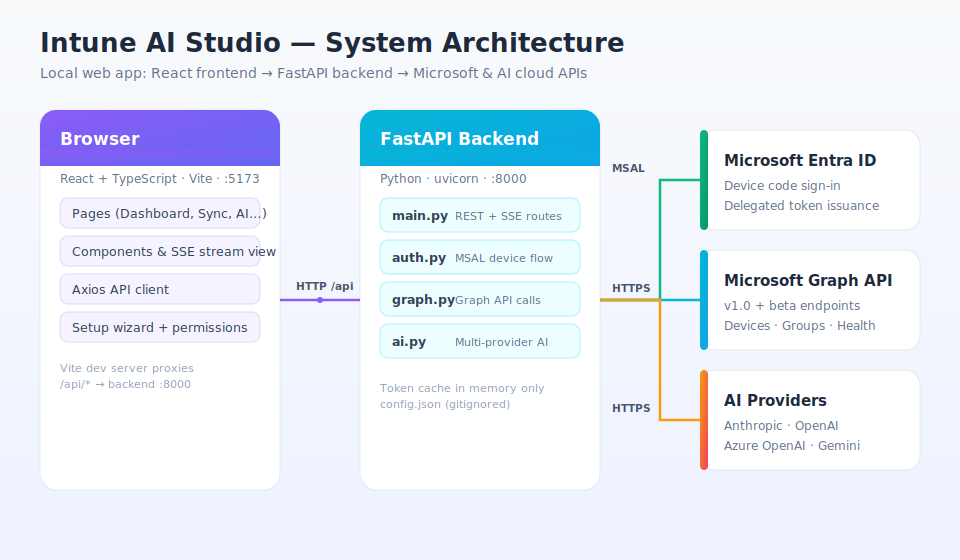
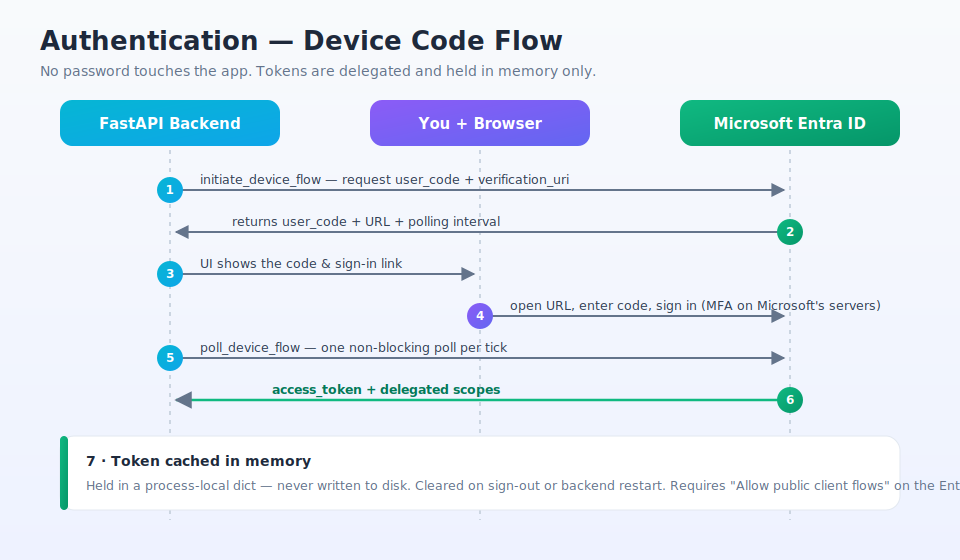
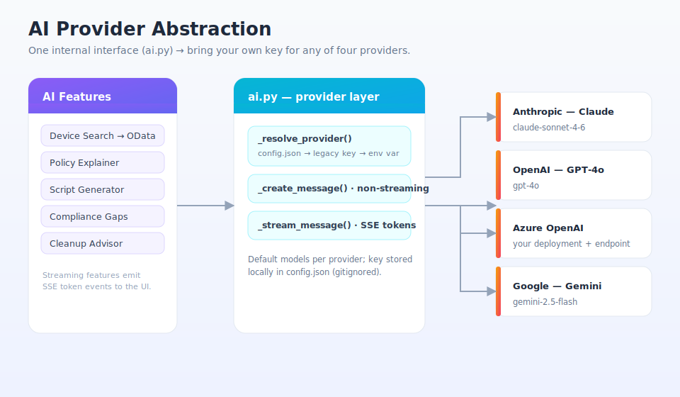

# Architecture

How Intune AI Studio is put together, how it authenticates, and how the AI layer stays
provider-agnostic.

## System overview

It's a two-process local app:

- **Frontend** — React + TypeScript built with Vite, served on `http://localhost:5173`.
  Pages call the backend through an Axios client; the Vite dev server proxies `/api/*` to
  the backend so there's no CORS friction in development. The backend additionally allows
  the `:5173` origin explicitly (`CORSMiddleware` in [`backend/main.py`](../backend/main.py)).
- **Backend** — FastAPI on `http://localhost:8000`, run with uvicorn. It owns all secrets
  and all outbound calls. Four modules:

  | Module | Responsibility |
  |--------|----------------|
  | [`main.py`](../backend/main.py) | REST + SSE route definitions, request validation (Pydantic), `require_token()` guard |
  | [`auth.py`](../backend/auth.py) | MSAL public-client device-code flow, in-memory token cache, permission status |
  | [`graph.py`](../backend/graph.py) | Microsoft Graph calls (`v1.0` + `beta`), `$batch` fan-out, OData escaping, SSE pipeline |
  | [`ai.py`](../backend/ai.py) | Multi-provider AI abstraction, streaming + non-streaming, the five AI features |

- **External APIs** — Microsoft Entra ID (sign-in), Microsoft Graph, and one AI provider.

Two response styles are used: plain JSON for request/response endpoints, and
**Server-Sent Events** (`text/event-stream`) for anything long-running or token-by-token —
Force Sync and every streaming AI feature.

## Authentication — device-code flow

Sign-in uses MSAL's **device-code flow** with a **public client** (no client secret). The
backend never sees your password — you authenticate on Microsoft's own pages.

1. `initiate_device_flow()` asks Entra for a `user_code` + `verification_uri`, requesting
   all eight delegated scopes at once.
2. The UI shows the code and link; you open it, enter the code, and sign in (MFA included).
3. The backend polls with `acquire_token_by_device_flow(..., exit_condition=lambda f: True)`
   so each poll returns immediately instead of blocking for the whole ~15-minute flow.
4. On success the token result is cached in a **process-local dict** (`_token_cache`).

Key properties:

- **Tokens are memory-only.** Nothing is written to disk; a backend restart or
  `logout()` clears them. Tokens are good for ~1 hour — sign back in when they expire.
- **Permission visibility.** `get_permission_status()` decodes the granted scopes from the
  token and the UI shows a live checklist, so you can see exactly what was consented.
- **Friendly errors.** Common AAD failures are translated to actionable text — most notably
  `AADSTS7000218`, which means **"Allow public client flows"** isn't enabled on the app
  registration (the single most common setup miss).

> The required app-registration setting: *Entra ID → App registrations → your app →
> Authentication → Advanced settings → Allow public client flows → **Yes***.

## AI provider abstraction

Every AI feature goes through one internal interface in [`ai.py`](../backend/ai.py), so the
features don't know or care which provider is active. Supported providers and their default
models:

| Provider | Default model | Notes |
|----------|---------------|-------|
| `anthropic` | `claude-sonnet-4-6` | |
| `openai` | `gpt-4o` | |
| `azure` | `gpt-4o` | needs an `endpoint`; uses the Azure OpenAI client |
| `gemini` | `gemini-2.5-flash` | Google GenAI SDK |

**How the active provider is resolved** — `_resolve_provider()` checks, in order:

1. `config.json` (`ai_provider` + `ai_api_key`, written by the in-app AI setup),
2. a legacy `anthropic_api_key` field (back-compat),
3. provider environment variables (`ANTHROPIC_API_KEY`, `OPENAI_API_KEY`,
   `AZURE_OPENAI_API_KEY`, `GEMINI_API_KEY`).

**Two call shapes** wrap each provider's SDK behind a uniform signature:

- `_create_message(system, user)` → one full string. Used by **Device Search**, which needs
  the complete JSON before it can run a Graph query.
- `_stream_message(system, user)` → an async iterator of SSE `token` events. Used by
  **Policy Explainer**, **Script Generator**, **Compliance Gaps**, and **Cleanup Advisor**,
  so output renders progressively in the UI. Errors are surfaced as an SSE `error` event.

The API key is stored locally in `config.json` and sent only to the provider you chose.

## Security model

- **Local-first.** Built for `localhost`; don't expose port 8000 to the internet.
- **Delegated only.** The app acts as the signed-in admin — it can't do anything your
  account can't.
- **Secrets stay local.** Client ID, Tenant ID, and the AI key live in `backend/config.json`
  (gitignored). Tokens never leave memory.
- **OData-injection protection.** All user-supplied values interpolated into Graph
  `$filter` strings are escaped by `_odata_escape()` in [`graph.py`](../backend/graph.py).
- **Timeouts everywhere.** Outbound Graph/AI calls use bounded `httpx` timeouts
  (30–120s depending on the operation) so a hung upstream can't wedge the backend.
