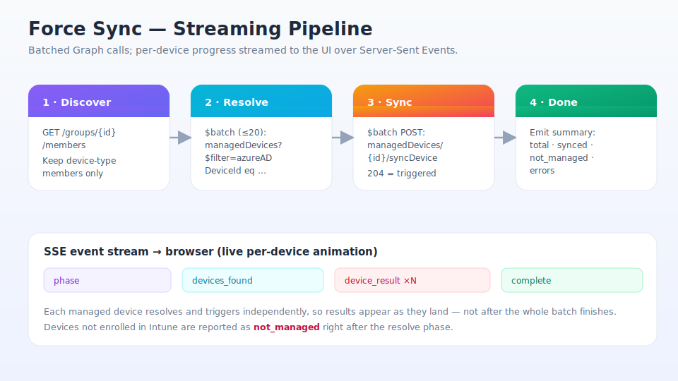
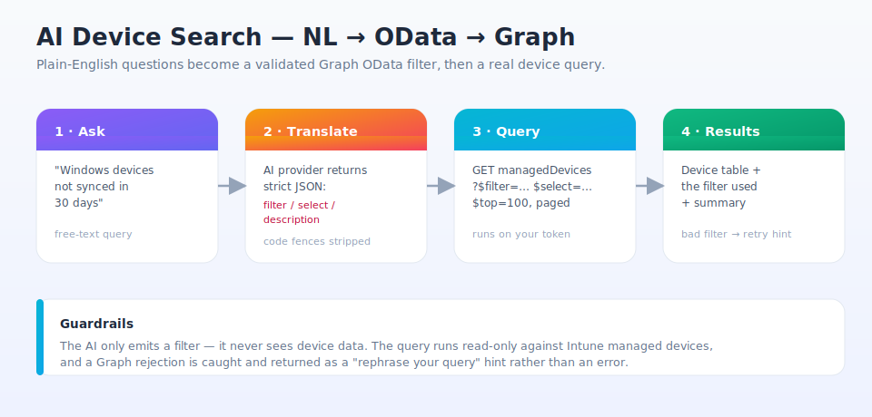

# Features Reference

One page for every feature: what it does, how it works, the permissions it uses, the APIs
it calls, and its backend route. Permissions are the delegated Graph scopes from
[`backend/auth.py`](../backend/auth.py); call sites are in
[`backend/graph.py`](../backend/graph.py) and [`backend/ai.py`](../backend/ai.py).

All endpoints require an authenticated session (`require_token()`), so `User.Read` and a
valid token are implied everywhere and omitted from the per-feature lists below.

## Quick map

| Feature | Key scopes | Key API calls |
|---|---|---|
| [Dashboard](#dashboard) | `DeviceManagementManagedDevices.Read.All`, `Directory.Read.All`, `ServiceHealth.Read.All` | `/organization`, `/deviceManagement/managedDevices`, `/admin/serviceAnnouncement/healthOverviews` |
| [Bulk Device Add](#bulk-device-add) | `Directory.Read.All`, `Group.ReadWrite.All` | `$batch` → `/devices` filter, `POST /groups/{id}/members/$ref` |
| [Force Sync](#force-sync) | `Group.ReadWrite.All`, `DeviceManagementManagedDevices.Read.All`, `…PrivilegedOperations.All` | `/groups/{id}/members`, `$batch managedDevices?$filter=azureADDeviceId`, `$batch POST …/syncDevice` |
| [Group Audit](#group-audit) | `DeviceManagementConfiguration.ReadWrite.All`, `DeviceManagementApps.Read.All` | `/deviceConfigurations`, `/deviceCompliancePolicies`, `/deviceAppManagement/mobileApps`, beta `/deviceManagement/intents` |
| [Group Members](#group-members) | `Group.ReadWrite.All`, `Directory.Read.All` | `/groups/{id}`, `/groups/{id}/members` |
| [Device Search (AI)](#device-search-ai) | `DeviceManagementManagedDevices.Read.All` + AI key | AI provider → `/deviceManagement/managedDevices?$filter=…` |
| [Policy Explainer (AI)](#policy-explainer-ai) | AI key | AI provider (streaming) |
| [Script Generator (AI)](#script-generator-ai) | AI key | AI provider (streaming) |
| [Compliance Gaps (AI)](#compliance-gaps-ai) | Group Audit scopes + AI key | group audit calls → AI provider |
| [Cleanup Advisor (AI)](#cleanup-advisor-ai) | Group + audit scopes + AI key | `/groups/{id}`, members, audit → AI provider |

---

# Admin Tools

## Dashboard

- **What it does** — Shows the tenant name, managed-device counts by OS, and a live
  Microsoft service-health indicator for Intune and Entra.
- **How it works** — `get_dashboard_data()` runs two Graph calls concurrently: read the
  org `displayName`, and page through all managed devices selecting only `operatingSystem`,
  then buckets the counts. Service health is a separate call that matches Intune/Entra by
  substring and de-duplicates the "Azure Active Directory" vs "Microsoft Entra" names. A
  `403` on the health call is reported as *permission missing* rather than an error, so the
  dashboard still loads.
- **Permissions used** — `DeviceManagementManagedDevices.Read.All` (devices),
  `Directory.Read.All` (org info), `ServiceHealth.Read.All` (health).
- **APIs used** — `GET /organization`, `GET /deviceManagement/managedDevices`,
  `GET /admin/serviceAnnouncement/healthOverviews`.
- **Backend route** — `GET /api/dashboard`, `GET /api/health/services`.

## Bulk Device Add

- **What it does** — Upload a CSV of device names and add them all to a group in one pass.
- **How it works** — Two steps. `resolve_device_names()` looks up each name → Entra device
  object ID using the Graph **`$batch`** API (20 requests per batch, batches run
  concurrently). Then each resolved device is added to the group via a `$ref` POST. Results
  are bucketed into `added` / `already_member` / `not_found` / `error` with a summary.
- **Permissions used** — `Directory.Read.All` (resolve device objects),
  `Group.ReadWrite.All` (add members). Capped at 500 names per request.
- **APIs used** — `POST /$batch` → `GET /devices?$filter=displayName eq '…'`,
  `POST /groups/{id}/members/$ref`.
- **Backend route** — `POST /api/devices/bulk-add`.

## Force Sync

- **What it does** — Triggers an immediate Intune check-in for every managed device in a
  group, with live per-device progress.
- **How it works** — A four-phase pipeline (see diagram): **discover** group members and
  keep only device objects → **resolve** each `azureADDeviceId` to its Intune
  `managedDevice` ID via batched lookups → **sync** by batch-POSTing `syncDevice`
  (a `204` means triggered) → **done**. The streaming variant
  (`sync_group_devices_stream`) emits SSE events — `phase`, `devices_found`,
  `device_result` (one per device, including `not_managed` for devices not enrolled in
  Intune), and `complete` — so the UI animates each device as its result lands.
- **Permissions used** — `Group.ReadWrite.All` (read members),
  `DeviceManagementManagedDevices.Read.All` (resolve managed devices),
  `DeviceManagementManagedDevices.PrivilegedOperations.All` (the `syncDevice` action).
- **APIs used** — `GET /groups/{id}/members`,
  `POST /$batch` → `GET /deviceManagement/managedDevices?$filter=azureADDeviceId eq '…'`,
  `POST /$batch` → `POST /deviceManagement/managedDevices/{id}/syncDevice`.
- **Backend route** — `POST /api/groups/{id}/sync` (one-shot),
  `GET /api/groups/{id}/sync/stream` (SSE).

## Group Audit

- **What it does** — Lists every config profile, compliance policy, and app assigned to a
  group — what you'd want to check before deleting it. Exports to CSV.
- **How it works** — `get_group_audit()` pages three Graph collections concurrently with
  `$expand=assignments`, then filters each to items whose assignment target matches the
  group ID (`_is_assigned_to_group`). Endpoint-security baselines come from the **beta**
  `intents` endpoint, fetched per-intent and tolerant of failure (returns empty if the beta
  call errors). `audit_to_csv()` flattens the result for download.
- **Permissions used** — `DeviceManagementConfiguration.ReadWrite.All` (config profiles +
  compliance policies + intents), `DeviceManagementApps.Read.All` (apps).
- **APIs used** — `GET /deviceManagement/deviceConfigurations`,
  `GET /deviceManagement/deviceCompliancePolicies`,
  `GET /deviceAppManagement/mobileApps?$filter=isAssigned eq true`,
  beta `GET /deviceManagement/intents` (+ per-intent `/assignments`).
- **Backend route** — `GET /api/groups/{id}/audit`, `GET /api/groups/{id}/audit/export`.

## Group Members

- **What it does** — Browse all devices in a group with an OS breakdown; filter and export
  to CSV. Also powers the group search box used across the app.
- **How it works** — `search_groups()` does a `startswith(displayName,'…')` filter
  (escaped for OData safety) for the picker; `get_group_members()` pages the group's members
  selecting display name, `deviceId`, and OS fields. `members_to_csv()` handles export.
- **Permissions used** — `Group.ReadWrite.All` (search + read groups),
  `Directory.Read.All` (member directory objects).
- **APIs used** — `GET /groups?$filter=startswith(displayName,'…')`, `GET /groups/{id}`,
  `GET /groups/{id}/members`.
- **Backend route** — `GET /api/groups/search`, `GET /api/groups/{id}`,
  `GET /api/groups/{id}/members`, `GET /api/groups/{id}/members/export`.

---

# AI-Powered Features

All AI features run through the provider abstraction in
[`ai.py`](../backend/ai.py) — see [architecture.md](architecture.md#ai-provider-abstraction).
They require an AI key configured locally (`config.json` or an env var) **in addition** to
the Graph scopes listed. The streaming ones return SSE `token` events.

## Device Search (AI)

- **What it does** — Turns a plain-English question ("Windows devices not synced in 30
  days") into a real Intune device query.
- **How it works** — `device_search()` sends the query (plus today's date) to the AI with a
  system prompt listing the filterable `managedDevice` properties and OData rules. The model
  returns **strict JSON** (`filter` / `select` / `description`); markdown code fences are
  stripped before parsing. The backend then runs that filter against Graph, paged, `$top=100`.
  The AI never sees device data — only emits a filter — and a Graph rejection comes back as a
  "rephrase your query" hint rather than a hard error.
- **Permissions used** — `DeviceManagementManagedDevices.Read.All` (run the query) + AI key.
- **APIs used** — AI provider (non-streaming), then
  `GET /deviceManagement/managedDevices?$filter=…&$select=…`.
- **Backend route** — `POST /api/ai/device-search`.

## Policy Explainer (AI)

- **What it does** — Paste a config-profile/policy JSON and get a plain-English breakdown of
  what each setting does, its end-user impact, and security implications.
- **How it works** — `explain_policy_stream()` wraps the JSON in a prompt and streams the
  model's markdown answer straight to the UI as SSE tokens. No Graph calls beyond the auth
  check — the policy JSON is supplied by the user (max 50,000 chars).
- **Permissions used** — AI key only (session auth required, no extra Graph scope).
- **APIs used** — AI provider (streaming).
- **Backend route** — `POST /api/ai/policy-explain` (SSE).

## Script Generator (AI)

- **What it does** — Describe a problem and get a deployable Intune remediation **pair** —
  a detection + remediation PowerShell script with deployment notes.
- **How it works** — `generate_remediation_stream()` uses a system prompt encoding Intune
  remediation conventions (PS 5.1, SYSTEM context, exit-code semantics, logging) and streams
  the result. No Graph calls beyond auth; input is the free-text description (max 2,000 chars).
- **Permissions used** — AI key only.
- **APIs used** — AI provider (streaming).
- **Backend route** — `POST /api/ai/remediation-script` (SSE).

## Compliance Gaps (AI)

- **What it does** — Reviews a group's assigned policies against Microsoft security
  baselines and reports gaps with risk ratings and specific recommendations.
- **How it works** — `compliance_gap_stream()` first calls the same **Group Audit** logic to
  gather the group's config profiles, compliance policies, and apps, summarizes them to JSON,
  and streams an analysis from the model. `status` SSE events report progress while the audit
  runs.
- **Permissions used** — the Group Audit scopes
  (`DeviceManagementConfiguration.ReadWrite.All`, `DeviceManagementApps.Read.All`) + AI key.
- **APIs used** — the Group Audit Graph calls, then the AI provider (streaming).
- **Backend route** — `POST /api/ai/compliance-gap` (SSE).

## Cleanup Advisor (AI)

- **What it does** — Tells you whether a group is safe to delete, with an impact analysis
  and a pre-deletion checklist.
- **How it works** — `group_cleanup_stream()` gathers the group's properties, member sample,
  and full assignment audit (and flags dynamic groups via `groupTypes`), packages it as JSON,
  and streams a verdict (✅ safe / ⚠️ caution / 🛑 do-not-delete) plus reasoning.
- **Permissions used** — `Group.ReadWrite.All` + `Directory.Read.All` (group + members) and
  the Group Audit scopes (assignments) + AI key.
- **APIs used** — `GET /groups/{id}`, `GET /groups/{id}/members`, the Group Audit calls,
  then the AI provider (streaming).
- **Backend route** — `POST /api/ai/group-cleanup` (SSE).
